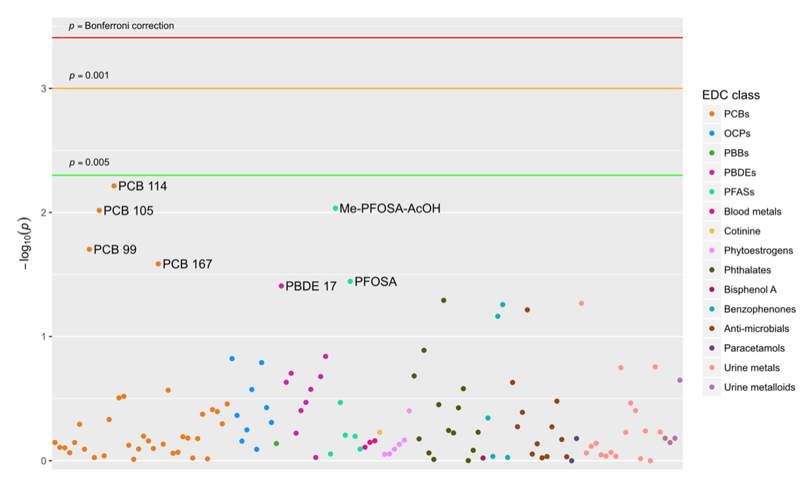
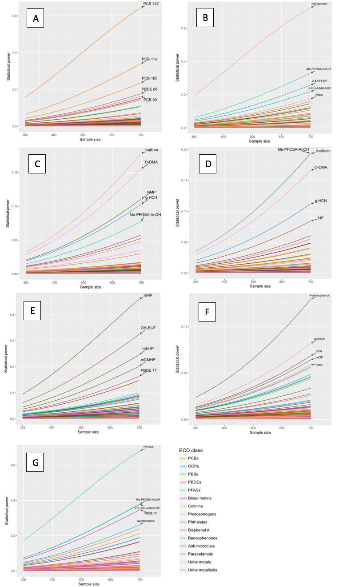
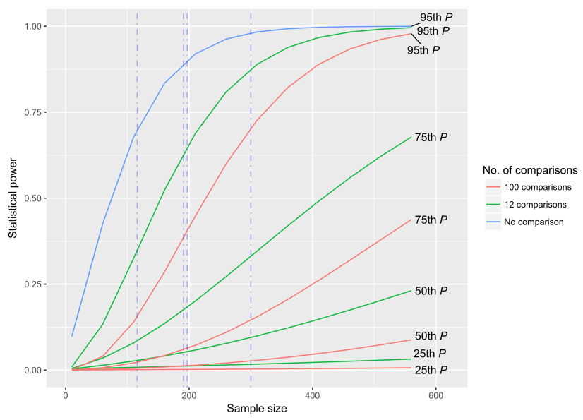

# Exposome-wide association studies require larger sample sizes to discover unbiased associations between semen quality and endocrine disruptor exposures

<!--
*Submitted for peer review, Fall 2017*
-->

## Authors
- Ming Kei (Jake) Chung
  - github: [\@jakemkc](http://github.com/jakemkc)
  - twitter: [\@jakekei](http://twitter.com/jakekei)
  - email: jake_chung[at]hms[dot]harvard[dot]edu
- Germaine M. Buck Louis
  - email: glouis[at]gmu[dot]edu
- Kurunthachalam Kannan
  - email: kurunthachalam[dot]kannan[at]health[dot]ny[dot]gov
- Chirag J. Patel
  - github: [\@chiragjp](http://github.com/chiragjp)
  - web: [www.chiragjpgroup.org](http://www.chiragjpgroup.org)
  
## Figure 4
 

Figure 4. Manhattan plot showing the results from multivariate exposome-wide association study. We tested the null hypothesis that endocrine disrupting chemicals (EDCs) were not associated with any of the seven semen quality endpoints. The Y axis represents the –log10 of the p values associated with multivariate F statistic. The X axis represents the 128 EDCs from persistent lipophilic to non-persistent compounds (left to right) that are colored by chemical class. Horizontal lines are drawn at p values of 0.005, 0.001, and Bonferroni correction level (0.05/128). None of the EDCs were statistically significant at a false discovery rate of 0.1. EDCs with p values < 0.05 are labeled. PCB: Polychlorinated biphenyl; OCPs: Organochlorine pesticides; PBBs: Polybrominated biphenyls; PBDE: Polybrominated diphenyl ether; PFASs: Per- and polyfluoroalkyl substances; Me-PFOSA-AcOH: 2-(N-methyl-perfluorooctane sulfonamido) acetate; PFOSA: Perfluorooctane sulfonamide.

## Figure 5
 

Figure 5. Graph showing the relationships between statistical power and sample size in the LIFE Study. The graph reflects post hoc power analysis using empirical data. Figure A to G represent analyses with different endpoints. A) next day motility; B) seminal volume; C) sperm concentration; D) total sperm count; E) morphology (WHO criteria); F) DNA fragmentation, and G) high DNA stainability. For example, in A), we regressed sperm motility on each endocrine disrupting chemical (EDC) separately. We calculated Cohen's ƒ2 as the effect size and used a Bonferroni corrected significance level at 0.05/128 to estimate power. In the graph, each of the 128 EDCs is represented by a curve. The color of the curve denotes the EDC class. The top five EDCs are annotated. PCB: Polychlorinated biphenyl; OCPs: Organochlorine pesticides; PBBs: Polybrominated biphenyls; PBDE: Polybrominated diphenyl ether; PFASs: Per- and polyfluoroalkyl substances.

## Figure 6
 

Figure 6. Graph showing the relationships between statistical power and sample size, using data from four published semen quality studies. Vertical dash-dot blue lines indicate study sample sizes. We have shown the results in three different Bonferroni-corrected significance level (α) scenarios: no comparison (α = 0.05); 12 comparisons per study (α = 0.05/12), which is the average of selected studies; 100 comparisons per study (α = 0.05/100), which is a value we arbitrarily set for a comprehensive exposome-wide association study. We extracted a total of 47 Pearson correlation coefficients as input and used Bonferroni corrected α to estimate power. In the graph, curves corresponding to the correlations at 25th, 50th, 75th and 95th percentiles (P) are shown.
 

 
 
 
